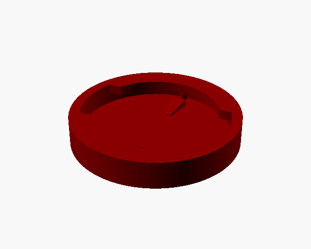
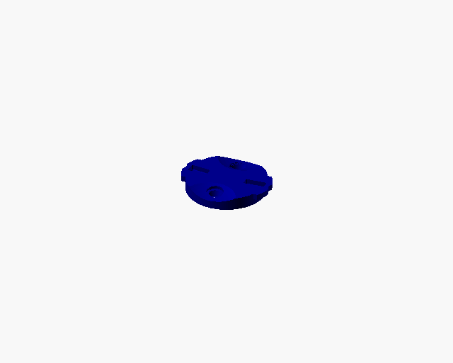
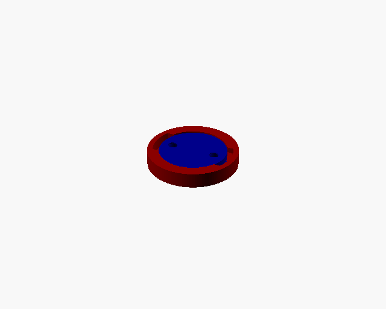
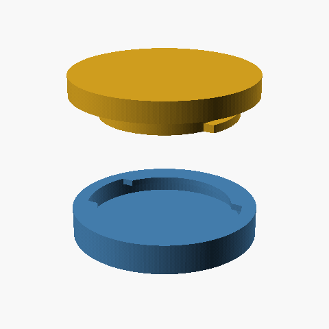

<!-- AUTO-GENERATED from qtm01.scad by build_docs.py — do not edit by hand. -->

# QTM01 — Garmin / Wahoo Quarter-Turn Mount

```
 QTM01 / Garmin–Wahoo quarter-turn mount  —  MALE + FEMALE pair
 Two interlocking parts:
   - MALE   : the cleat (central post + two ears / tabs)
   - FEMALE : the receptacle (slotted lip that captures the ears)

 Insert the male tabs through the two entry slots in the female lip,
 push down into the chamber, then twist 90 deg -> tabs are trapped
 under the solid lip sections.  Classic quarter-turn bayonet.

 Geometry is reverse-engineered from the community reference
 (chadkirby/quarter-turn-mount) and matches the verified table:

   post / body dia ...... 24.9   (26 clearance hole)
   tab span tip-to-tip .. 28.6
   tab width ............ 11
   tab thickness ........ 1.5
   lip / gap under tab .. 1.25
   entry slot width ..... 12.5   (= 11 + 1.5)
   overall body dia ..... 36

 Render one part at a time for printing, or preview the fit.
```

## Parts

### female

The receptacle: a capture lip with two entry slots over a tab chamber.



Print: `openscad -o female.stl -D 'part="female"' qtm01.scad`

### male

The cleat: a central post carrying two locking ears.



Print: `openscad -o male.stl -D 'part="male"' qtm01.scad`

## Preview

### assembled

The seated, locked fit (static preview).



## Assembly

### animate

Quarter-turn assembly — drop in, then twist 90 deg to lock.



## Parameters


**What to render**

| Parameter | Value | Description |
|---|---|---|
| `part` | `"both"` | one of: male, female, both, assembled, animate, section |

**Verified quarter-turn geometry (mm) — do not change**

| Parameter | Value | Description |
|---|---|---|
| `post_d` | `24.9` | central post / body diameter |
| `tab_span` | `28.5` | tab tip-to-tip (across the ears) |
| `tab_w` | `11` | tab width (across the ears) |
| `tab_th` | `1.8` | tab thickness (the male feature that engages the female) |
| `lip` | `2` | lip / "губка" thickness on top |
| `hole_d` | `25.15` | female central hole diameter |
| `cavity_d` | `29.5` | female inner chamber diameter ("тубус") |
| `body_d` | `33.5` | overall body diameter |
| `slot_w` | `12.5` | tab entry slot width |

**Print tuning**

| Parameter | Value | Description |
|---|---|---|
| `clr` | `0` | 0 = exact replica; raise (e.g. 0.3) for a printed sliding fit |
| `ear_oval` | `0.8` | ear shape: 1 = circle, <1 = elongated oval along the span, >1 = flatter |
| `post_h` | `3.75` | MALE HEIGHT: the whole cleat (post + ears at its tip) |
| `base_h` | `0` | optional grip flange under the cleat (0 = bare cleat) |
| `total_h` | `5.5` | FEMALE overall height (the floor is derived to match) |
| `fillet_r` | `0.2` | chamfer size on the lock features (pockets + ramps); 0 = sharp |
| `$fn` | `120` |  |
| `eps` | `0.01` |  |

**Preview colors**

| Parameter | Value | Description |
|---|---|---|
| `male_color` | `"DarkBlue"` | male part colour in previews / animation |
| `female_color` | `"DarkRed"` | female part colour in previews / animation |

**Fixator — edge notch on the ears that locks the 90 deg position**

| Parameter | Value | Description |
|---|---|---|
| `detent` | `true` | cut the edge notch (fixator) |
| `notch_dia` | `27.5` | deepened so the 1 mm female bump seats (was 28.3) |
| `notch_w` | `3.0` | width of the notch along the ear edge  (TODO: уточнить) |
| `pocket_play` | `0.4` | vertical headroom for the ear in the chamber |
| `pocket_h` | `tab_th + pocket_play` |  |
| `floor_th` | `total_h - pocket_h - lip` | derived so the female height = total_h |

**Female fixator — bumps that catch the ear notches**

| Parameter | Value | Description |
|---|---|---|
| `bump_h` | `1.0` | how far each bump stands proud of the chamber wall |
| `bump_w` | `1.5` | bump width (looks like part of a tube) |

**Clearance scoops — spheres on the male, sides without ears (±Y)**

| Parameter | Value | Description |
|---|---|---|
| `scoop_d` | `2 * post_d` | sphere diameter ~ 2x the male main diameter (≈49.8) |
| `scoop_min_h` | `2.45` | remaining male height at the deepest point (depth 1.3) |

**Through-holes on the male — in the scoop regions (±Y)**

| Parameter | Value | Description |
|---|---|---|
| `side_hole_d` | `3.45` | through-hole diameter |
| `side_hole_ed` | `2.5` | gap from the outer edge to the NEAR edge of the hole |
| `head_d` | `5.25` | bolt-head recess diameter (top cylinder + cone wide end) |
| `hole_remain` | `0.3` | plain through-hole left at the very bottom |

**Trapezoid lock — pockets on the male leading (mating) face**

| Parameter | Value | Description |
|---|---|---|
| `trap_offset` | `2.05` | gap from the outer edge to the pocket (outer end R=12.2) |
| `trap_len` | `5.95` | pocket length: outer R=12.2 -> inner R=6.25 |
| `trap_w_out` | `3.0` | pocket width at the outer (wide) end |
| `trap_w_in` | `2.0` | pocket width at the centre (narrow) end |
| `trap_depth` | `1.5` | pocket depth |

**Trapezoid lock — ramps on the female floor**

| Parameter | Value | Description |
|---|---|---|
| `ramp_len` | `4.9` | ramp length (radial) |
| `ramp_r_in` | `6.7` | inner-end radius (the two inner ends are 13.4 mm apart) |
| `ramp_w_out` | `2.7` | ramp width at the outer (wide) end |
| `ramp_w_in` | `1.0` | ramp width at the inner (narrow) end |
| `ramp_h` | `1.0` | ramp height at the outer edge |
| `ramp_h_in` | `0.2` | ramp height toward the centre (lower) |
